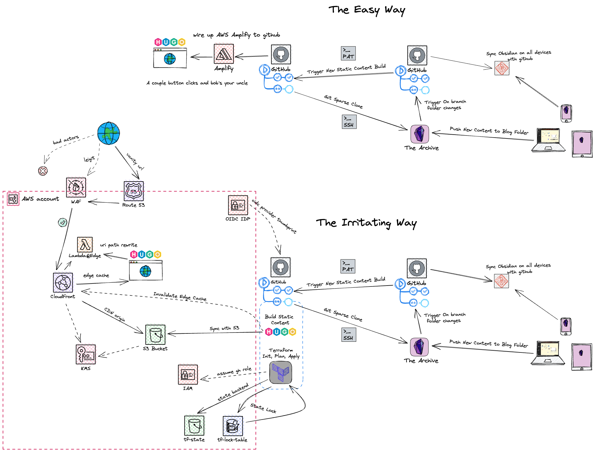
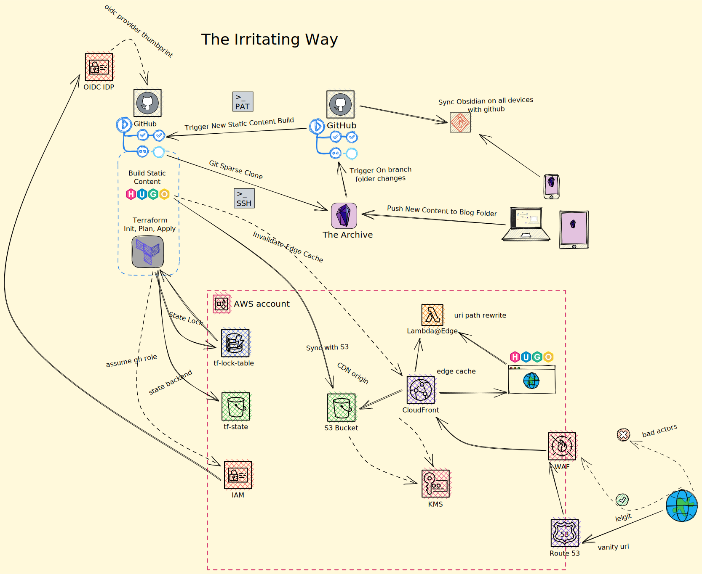

---
title: It's still day 1...
author: Patrick Deutsch
type: "posts"
date: 2023-05-07T21:39:46-06:00
lastmod: 2023-05-07T21:40:06-06:00
url: /2023/05/01/its-still-day-1
excerpt: It's still day 1
categories:
  - articles
  - tech
tags:
  - blog
  -  aws
  -  cloudfront
  -  route53
  -  certificates
  -  s3
  -  terrafrom
---

## Premise
Why is note taking hard? Years ago I found a goove using OneNote and I was pretty consistent and prolific user of it(albit a very basic user). I was reliable at keeping a daily activty log, what I was going to to next, planning my projects, however after a major data loss incident due to their OneNotes weird syncing, their haphazard migration to cloud product, my migration from android to ios ,and various other grivences with the OneNote product, I kinda gave up on OneNote maintaining my source source of truth for digitial note takeing. Since then my note taking experience has been sub par, its fragmented across services like Apple notes, Google Keep, Evernote, Notion, OneNote, Bear, email, or for a while just google docs and notebooks & journals scattered throughout my office, kitchen, and various bags. and moved almost entirely hand written journals. This year I decided i'd reset the foundations. Through wispers and conversations in slack, I'd thought i'd give Obsidian a shot. I got off to a slow start, I didn't dive too deep into the product and knew it supported markdown notes(my current preffered digital format). 

I'm fond of mocking up my undestanding of how something works by drawing some lines and some notes. I'm particularly a fan of mermaid, plantuml diagram tools and C4 context diagrams as there is a programatic means to convegue logical undersanding. People and Teams can programatically create generate diagrams to reflect logical structures of the application, database, or code base. You can have ci/cd tools update the codebase to have always current version. Though when conveguing understanding to a wider audiance that may not as intune with a codebase, newly learning ideas, or just not technical. I've found that vibrant color coordinated imaged based diagrams help to bridge the gap. You can see this with content produced by ByteByteGo or the team with Swirl AI. I really graviated to the content that Aurimas Griciūnas was producting with Swirl AI. I reach out to see how he was making his diagrams and found out about Excalidraw. I immediatelly started using it to mock out my understanding of complex services ideas. 

So up now at this point i'm newly mocking up excalidraw diagrams, and trying to start fresh with coordinating notes on the go, and also happen to writing content for internal engineering blog articles and presentations. At this time a former colleague of mine was a prolific sharer of tech tid bits, articles, repos, tweets related to software engineering his shares gained somewhat of a cult following, with a dedicated slack channel with an RSS feed. I was curious how he was managing this firehose of information. He shared is secrets he's just using Obsidian to take note of anything he finds cool with obsidian notes. Then converts the notes to a website. See his site and rss feed: https://notes.billmill.org/ Or the source code: https://github.com/llimllib/obsidian_notes/blob/main/templates/index.html. This was the beginning of my the light bulb moment. I doubled down on Obsidian and began exploring the community plugins and there is a local excalidraw with the ability community scripts to wrangle diagrams. Game over.. I'm making this happen: Obsidian notes based dev blog with diagrams, just need to sort out the little bits. 

## Dev Blog
I have an on again off again relationship with dev blogs. I think this is my third iteration of hosting one, after a venture using, umbraco, ghost, and now Hugo. Let's see if it last more than a month. 🤞

This time I at least have a scope: host dev blog using a static content generator, use ci/cd to provision IaC, serverless, live update content from Obsidian notes. 

So for for choosing a static website generator I went Hugo, seemed popular and there a ton of theme support. Netlifty hosting is certainly the easiest, and AWS Amplify was a quick 2 stepper to get working. That's not quite what I wanted while it was easy. I was looking to surface the unseen leavers behind those services leavers being pulled or at least to some degree. So, there were a couple hiccups along my way. Like needing to setup an AWS org so I could use oidc role logins (for myself and machine roles), going through the new aws identity center sso. Coordinating obsidian git sync was both straight foward to setup, but I fee like I read into it too much, so had some churn there. Live updating on content pushes to GitHub was actually way easy. The hard parts were head banging moments on security headers being blocked and invalidating all the CDN content. 

Look! Embeded diagram mocked up in my note taking app:

[]
<!-- [] -->
<!-- [] -->

e little bits

Obsidian Note Taking
	Live git commit & sync(across devices via github)
	Write Markdown Notes, Blogs, Musings
	Template Generator
	Excalidraw
	
Static site generator (needs markdown support)
	Deploy Wireframe site 
Terraform
	State
		s3 bucket
		dynamodb
			make sure your table names in terraform match up 
	infra
		Route53
		Static Site S3 bucket
		Cloud Front CDN
			origin story
			Ciphers
				fighting with ciphers and other whatnots
			Security Headers
			X-site scripting 
			Edge Lambda (rewrite paths)
			WAF
			Certificate 
				Needs san name to pass 
		KMS
			encrypt the bucket, dynamodb table
		IAM
			Github Federated Idp
				Well known fingerprint
				Github Actions Assume Role
				
	ci/cd
		github actions
			terraform deploy
			sparse clone for hugo deploy
				uses deploy key to fetch private repo
			obsidian event push action
				uses pat token

CloudFront Al
release triggers are hard and finikey
