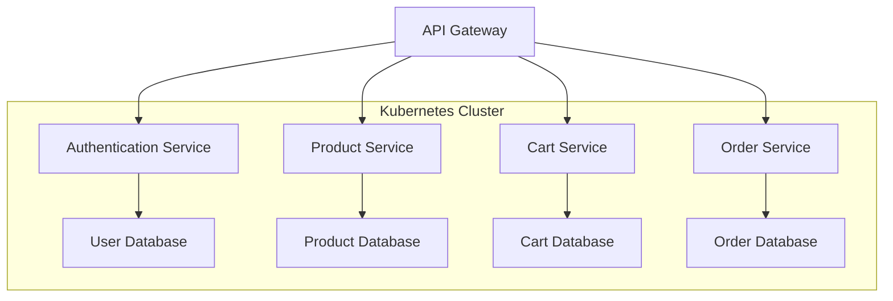
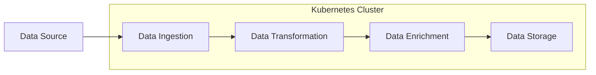
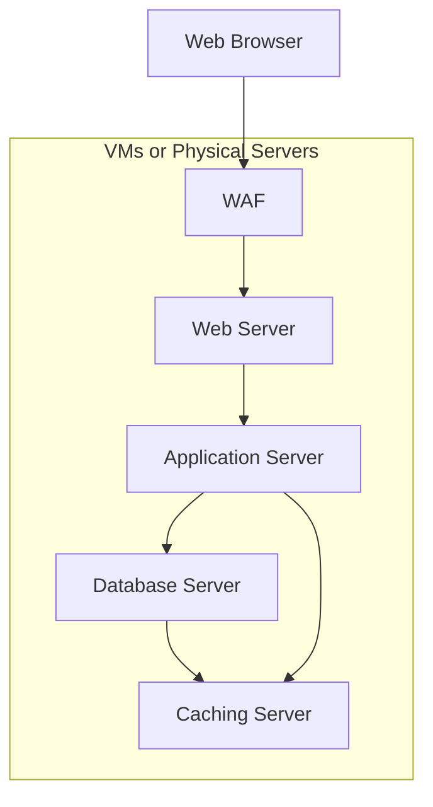
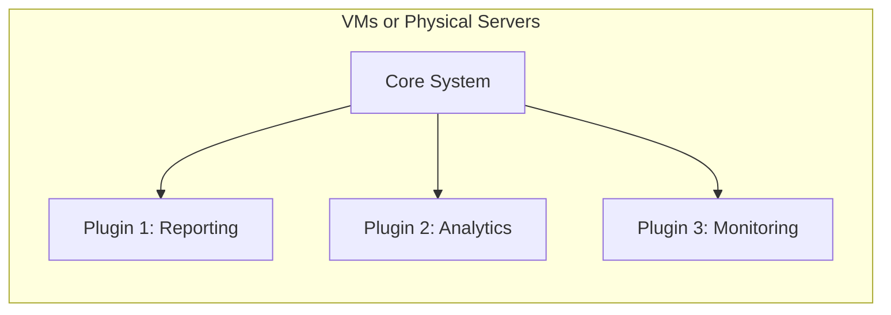
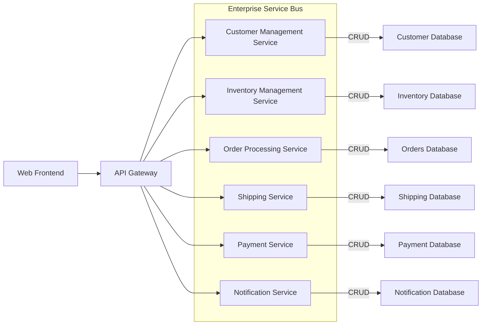
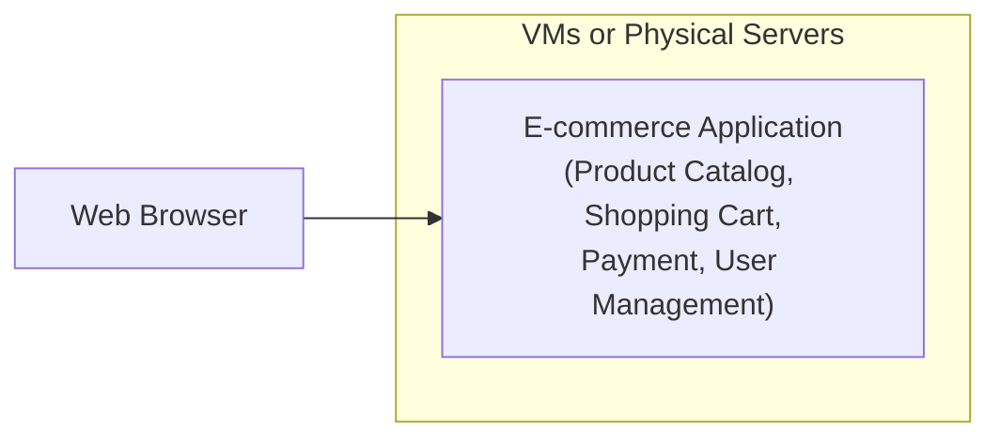

# When to NOT use Kubernetes

# When Kubernetes Might Not Be the Best Choice

Have you ever wondered if using a Kubernetes for a small to medium scale application is worth the complexity and overhead? In many cases, the benefits might not outweigh the costs (financial or emotional) or the added complexity needed to maintain a Kubernetes platform, particularly when the applications require few resources and have low traffic volume. When does Kubernetes make sense for your application? Let's take a look at some of the scenarios where Kubernetes may not be the best choice. What is the architecture of your application? Kubernetes is a natural fit for microservices, event-driven, and pipeline architectures, while may not be ideal for other architectures like n-tier, microkernel, service-oriented, or service-based architectures.

## What is Kubernetes?
<!-- insert link to diagram in ../diagrams/kubernetes.excalidraw.png -->
<!--  -->
[](static/kubernetes.excalidraw.png)

Getting back to the to some basics what is Kubernetes? Kubernetes is an open-source container orchestration platform used for automating deployments, scaling, and management of containerized applications. Kubernetes is particularly useful for large-scale applications with high traffic volume, and event-driven, microservice or pipeline architectures, where it provides powerful management, scaling, and deployment capabilities. Examples of such applications include e-commerce platforms, social media networks, and big data processing. In these scenarios, the benefits of Kubernetes often outweigh the complexity and overhead it introduces. Although, Kubernetes has numerous benefits and has proven to be a valuable tool for many developers and organizations, though it's not always the best solution for every scenario. There are certain situations where it's better to opt for a different container orchestration platform or not to use one at all.

### Containers

Containers offer a lightweight alternative to virtual machines, allowing you to package and run your applications in a standardized environment. Containers are portable, running on any infrastructure that supports them, including on-premises, cloud, or hybrid environments. Being more lightweight and efficient than virtual machines, containers enable running more applications on the same hardware. They are particularly well-suited for applications requiring consistent environments across development, testing, and production stages.

One major design choice to move from serverless to container orchestration platforms, services like Amazon ECS, AWS Fargate, and Kubernetes is code runtime will be heavily dependent on encapsulation within runtime containers. While Docker was once the de facto standard for containerization, alternative containerization tools like Containerd, Podman,  Buildah, CRI-O have gained popularity, partly in response to Docker's disruptive switch to an Oracle-like licensing model. These alternatives provide additional choices for organizations looking to adopt containerization in their software development and deployment processes.

### Kubernetes Features

* Automated rollouts and rollbacks
* Service discovery and load balancing
* Storage orchestration
* Self-healing
* Secret and configuration management
* Automatic bin packing
* Batch execution
* Horizontal scaling
* IPv4/IPv6 dual-stack
* Designed for extensibility
  
Now that we vaguely understand with a container is.  Here you’ll see some of the features that Kubernetes promotes. Think on how these features could useful for your operation and maybe that will shed some light on why it’s gaining so much popularity.

Paired with a thriving community, an ever expanding suite of 3rd party integrations, and the ease in which anyone can get started( minikube, kind, k3s),  really helps drive the adoption of K8s.

But it also happens that Kubernetes is particularly useful for large-scale applications with high traffic volume, that have streaming or batch operations and leverage microservices, event-driven, or pipeline architectures. 
 where Kubernetes provides powerful and consistent foundation for management, scaling, and deployment capabilities.

Examples of such applications that leverage Kubernetes include e-commerce platforms, streaming neworks, social media networks, and big data processing. In these scenarios, the benefits of Kubernetes often outweigh the complexity and overhead it introduces. 

### Common Architectures with K8s
#### Microservices

Microservices architecture involves breaking down an application into a collection of loosely coupled services. Each service is a self-contained unit that can be deployed and scaled independently. This architecture is particularly suitable for Kubernetes, as it can manage the lifecycle, scaling, and deployment of these services efficiently, making the application more scalable, resilient, and easy to maintain.

In this e-commerce application example, multiple services are deployed within a Kubernetes cluster. The API Gateway routes requests to the corresponding service (Authentication, Product, Cart, or Order). Each service communicates with its respective database.
<!--  -->
[](static/microservices.excalidraw.png)



#### Event-Driven

Event-driven architecture focuses on applications that are triggered by events that occur in the system. These applications react to events from various sources, such as user interactions or changes in data. Kubernetes is a good fit for event-driven applications when they are designed with microservices or when the application components need to be scaled independently. Kubernetes can manage the lifecycle of the application and its services, as well as scale the application to meet demand.

In this IoT application example, the IoT Device and User Application send events to the Event Bus, which routes the events to the appropriate services (Notification Service and Data Processing Service) within the Kubernetes cluster. These services handle notifications and data processing/storage.
<!--  -->
[](static/event-driven.excalidraw.png)

<details>
<summary>Mermaid</summary>

    ```mermaid
    %%{init: {'theme': 'pastel', "flowchart" : { "curve" : "basis" } } }%%
    graph TD
        A[IoT Device] --> B[Event Bus]
        C[User Application] --> B
        B --> D[Notification Service]
        B --> E[Data Processing Service]
        D --> F[User Database]
        E --> G[Data Storage]
        subgraph Kubernetes Cluster
        D
        E
        F
        G
        end
    ```
</details>

#### Pipeline

Pipeline architecture involves breaking down an application into a series of stages, where each stage processes the data and passes it to the next one. This architecture is suitable for data-intensive applications or workflows. Kubernetes can be a good fit for managing pipeline applications when individual stages can be deployed as independent services, allowing for efficient management, scaling, and deployment.

In this data processing pipeline example, data is ingested, transformed, enriched, and stored within a Kubernetes cluster. Each stage in the pipeline is a separate service managed by Kubernetes.
<!--  -->
[](static/pipeline.excalidraw.png)



## Scenarios Where Kubernetes May Not Be the Best Choice

### Legacy Applications
First up for hard situations where Kubernetes may not be the best fit is when dealing with legacy applications. Integrating older applications with new technology like Kubernetes can be challenging and may require significant effort and investment. Legacy applications are typically monolithic and have complex dependencies and architectures that can make them challenging to immediately containerize and integrate with modern technologies like ECS, Kubernetes, or Serverless.

 Legacy applications can require significant effort and investment to retrofit legacy applications for containerization, which may not be cost-effective. Even if they are containerized, their monolithic nature and complex dependencies can make it challenging to integrate with Kubernetes. For instance, legacy applications may have baked-in ideas about scaling mechanisms, logging, storage, or cross-instance communication that do not align well with Kubernetes' principles. In such cases, it might be more practical to use existing deployment methods that better suit the needs of these applications. 

<!--  -->
 If necessary apply the Strangler Pattern (aka "Strangler Fig" or  "Vine") to modernize a legacy applications it can be a lengthy ordeal. As usually a facade is propped up and new elements are developed around or on top of the existing legacy system allowing both to be run in parallel before the legacy elements are eventually migrated/swapped out.

### Small Teams
<!--  -->
Kubernetes can also be a poor fit for organizations with limited available resources. As the infrastructure, expertise, and resources required to run and maintain a Kubernetes cluster can be substantial.CNCF favors a reliance on an open-source ecosystem that encourages piecemeal design. With Kubernetes there is a plethora of third-party integrations, services, operators that all have varying opinions on how to achieve an outcome. Often, I have found myself taking detours to resolve hiccups of the functionality of the platform I took for granted(looking at your breaking changes Containerd).  A small team may not be able to keep pace with the wack-o-mole process of fixing breaking changes that come up.

 This ever expanding selection may be a less attractive option for organizations that want design for simplicity & not encourage flexibility. Managed Kubernetes services like Amazon EKS can help to reduce the expertise needed to set up and maintain a Kubernetes cluster. However, organizations still need to have a good understanding of Kubernetes concepts and best practices to effectively manage their applications, networking, security, and storage in the cluster.

### Steep Learning Curve

<!--  -->

Moreover, the learning curve for Kubernetes can be steep, and it may not be the best choice for organizations with limited IT staff or developers. The platform requires significant expertise in areas such as networking, security, storage, and CI/CD to be effectively deployed and managed. This expertise can be challenging to acquire and may not be feasible due to budgets, staffing, or available domain knowledge. Additionally, Kubernetes is a rapidly evolving platform that introduces breaking changes with each new release, requiring dedicated resources to keep up with the latest developments in the space.

### Regulatory and Cost Constraints
Kubernetes may not be the ideal choice for organizations with stringent regulatory or cost constraints, such as financial institutions or healthcare organizations. The platform's security features and network policies are inherently complex, necessitating substantial expertise for proper configuration and validation to meet compliance requirements. Organizations with strict regulations may find it difficult to grasp how services are secured, particularly when alternative services are available that rely on a cloud provider's shared responsibility model to assume most of the responsibility for securing systems.

Moreover, the cost of operating a Kubernetes cluster can be considerable. For instance, consider an EKS cluster running a service continuously, with the container image updated monthly for security reasons. Using the AWS Cost Calculator, the EKS control plane costs $73 per month. In addition to this, clusters require nodes for computation. Running a single service for a month using Fargate would cost around $270.33, while running comparable nodes (m6g.xlarge) on EC2 instances provides more flexibility in cost control, with pricing options ranging from approximately $50 to $112 per month. These price scenarios result in annual costs ranging from ~$1,500 to around ~$5,000 per cluster, excluding expenses for VPC, DNS, databases, additional clusters, or logging and monitoring. For organizations with limited budgets or cost-consciousness, adopting a serverless architecture or running services on dedicated EC2 Spot Instances can be more cost-effective solutions, as they offer the ability to scale to zero when not in use.

Kubernetes may not be the ideal choice for organizations with stringent regulatory or cost constraints, such as financial institutions or healthcare organizations. The platform's security features and network policies are inherently complex, necessitating substantial expertise for proper configuration and validation to meet compliance requirements. Kubernetes is not secure by default, so security practices are needed to keep everything secure. Paired with a large open-source ecosystem there may be a need to hand-roll container images create custom, secure, and optimized containers tailored to specific security posture. This could include services you might not have thought of that are bundled with Kubernetes. Organizations with strict regulations may find it difficult to grasp how services are secured, particularly when alternative services are available that rely on a cloud provider's shared responsibility model to assume most of the responsibility for securing systems.

Moreover, the cost of operating a Kubernetes cluster can be considerable. For instance, consider an EKS cluster running a service continuously, with the container image updated monthly for security reasons. Using the AWS Cost Calculator, the EKS control plane costs $73 per month. In addition to this, clusters require nodes for computation. Running a single service for a month using Fargate would cost around $270.33, while running comparable nodes (m6g.xlarge) on EC2 instances provides more flexibility in cost control, with pricing options ranging from approximately $50 to $112 per month. These price scenarios result in annual costs ranging from ~$1,500 to around ~$5,000 per cluster, excluding expenses for VPC, DNS, databases, additional clusters, or logging and monitoring. For organizations with limited budgets or cost-consciousness, adopting a serverless architecture or running services on dedicated EC2 Spot Instances can be more cost-effective solutions, as they offer the ability to scale to zero when not in use.
**

By considering alternatives like AWS Lambda, Docker Compose, and AWS Fargate, developers and organizations can choose the most appropriate solution for their unique circumstances. Real-life examples of applications that have successfully adopted these alternatives demonstrate the importance of selecting the right container orchestration platform based on individual requirements. Ultimately, making an informed decision can lead to more efficient development, deployment, and management of containerized applications, while also optimizing costs and resources.


[Software Architecture for the Cloud](https://medium.com/nerd-for-tech/software-architecture-for-the-cloud-c9226150c1f3) by Dick Dowdell

## Architecture Types that are not well suited for Kubernetes

### N-Tier
<div>
<!--  -->

N-tier architecture involves breaking down an application into a series of tiers, where each tier has a specific responsibility (e.g., presentation, business logic, data storage). While Kubernetes can be used to manage the lifecycle, scaling, and deployment of each tier, it is not inherently designed for n-tier architectures. However, it can still be a viable option for managing n-tier applications when the tiers are designed as independent services.

In this traditional n-tier web application example, the Web Server, Application Server, and Database Server are deployed on separate virtual machines (VMs) or physical servers. This monolithic architecture is less suitable for Kubernetes.

<!--  -->
[](static/n-tier.excalidraw.png)



### Microkernel

Microkernel architecture is over 50 years old it involves building an application with a minimal core system and a set of plug-ins or modules that extend its functionality. This architecture is not inherently designed for Kubernetes, as the focus is on a minimal core rather than independent services. However, if the plug-ins or modules can be containerized and managed independently, Kubernetes could be used for managing their lifecycle, scaling, and deployment.

In this microkernel-based monitoring system example, the Core System communicates with multiple plugins (Reporting, Analytics, Monitoring). The tight coupling between the core and plugins makes this architecture less suitable for Kubernetes. Web Browsers like Firefox, Chrome, and Safari and IDEs like EclipseIDE or VScode are examples of microkernel-based applications where capabilities are added through plug-ins or extensions.

<!--  -->
[](static/microkernel.excalidraw.png)



### Service-Oriented

Service-oriented architecture involves building an application as a collection of loosely coupled services. These services can be deployed and scaled independently, making the application more scalable, resilient, and easy to maintain. Kubernetes is a good fit for service-oriented applications when they are designed with microservices or when the application components need to be scaled independently. Kubernetes can manage the lifecycle of the application and its services, as well as scale the application to meet demand.

In this diagram, the API Gateway routes requests to appropriate services. Each service is responsible for a specific domain within the e-commerce application. Services are connected through the Enterprise Service Bus (ESB), which handles communication and integration between them. Each service has its own dedicated database for managing its domain-specific data with CRUD (create,read,update, and delete)operations and is connected to the ESB.

<!--  -->
[](static/service-oriented.excalidraw.png)



### Monolithic

Monolithic architecture refers to an application design pattern where the entire application is built as a single, cohesive unit. All the functionalities, including UI, business logic, and data management, are bundled together into one codebase, and the application is deployed as a single unit. Monolithic applications are tightly coupled and can be more challenging to maintain, update, or scale.

<!--  -->
[](static/monolithic.excalidraw.png)



It may be worth considering alternatives like AWS Lambda, Docker Compose, and AWS Fargate, but its should be up to the digression of the developers and organizations to choose the most appropriate solution for their unique circumstances. Real-life examples of applications that have successfully adopted these alternatives demonstrate the importance of selecting the right container orchestration platform based on individual requirements. Ultimately, making an informed decision can lead to more efficient development, deployment, and management of containerized applications, while also optimizing costs and resources.

## TLDR;

* Kubernetes is a powerful and versatile container orchestration platform that is particularly useful for large-scale applications with high traffic volume, where it provides powerful management, scaling, and deployment capabilities. However, for small-scale or simple applications, there may be more cost-effective and simpler solutions available.
* When dealing with legacy applications, integrating with Kubernetes can be challenging and may require significant effort and investment. It may be more feasible to stick to existing deployment methods or to use a different container orchestration platform that better suits the needs of these applications.
* Kubernetes requires significant expertise in areas such as networking, security, storage, and deployment to be effectively deployed and managed. This expertise can be challenging to acquire and may not be feasible due to budgets, staffing, or available domain knowledge.
* Kubernetes may not be the best choice for organizations with strict regulatory requirements, where it can likely be easier to lean on a Cloud provider's shared responsibility model to take on some of the operational responsibilities in securing systems.

## Resources

* [Software Architecture for the Cloud](https://medium.com/nerd-for-tech/software-architecture-for-the-cloud-c9226150c1f3)
* [do you need kubernetes?](https://doyouneedkubernetes.com/)
* [kind](https://kind.sigs.k8s.io/)
* [k3s](https://k3s.io/)
* [minikube](https://minikube.sigs.k8s.io/)

<iframe
    width="320"
    height="280"
    src="https://www.youtube.com/embed/RRykwyJkOIw"
    frameborder="0"
    allow="autoplay; encrypted-media"
    allowfullscreen
>
</iframe>

