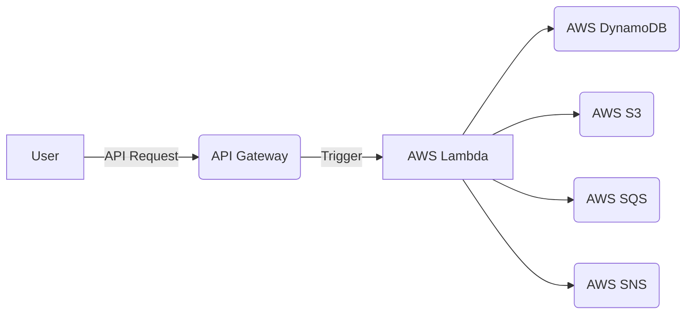

# Alternatives to Kubernetes

## Alternatives to Kubernetes

### Serverless
Suppose you are a developer working on a small application with a simple backend handling a limited number of API endpoints. In such cases, you can use serverless architectures, like AWS Lambda and API Gateway, to create a scalable and cost-effective backend that serves requests on demand.

Let's briefly explore some serverless resources:

AWS Lambda: A serverless compute service that allows you to run code without provisioning or managing servers. You pay only for the compute time you consume, with no charges when your code is idle. AWS Lambda automatically scales your application according to demand, handling anything from a few requests per day to thousands per second.

API Gateway: A fully managed service that enables developers to create, publish, maintain, monitor, and secure APIs at any scale. API Gateway can act as a front door for applications to access data, business logic, or functionality from your back-end services.

DynamoDB: A fully managed NoSQL database service providing fast and predictable performance with seamless scalability. DynamoDB offloads the administrative burdens of operating and scaling a distributed database, eliminating concerns about hardware provisioning, setup and configuration, replication, software patching, or cluster scaling.

SQS: A fully managed message queuing service that allows you to decouple and scale microservices, distributed systems, and serverless applications.

S3: A simple storage service offering extremely durable, highly available, and infinitely scalable object storage infrastructure at very low costs.

#### Serverless Architecture

Serverless architecture is a cloud computing execution model in which the cloud provider dynamically manages the allocation and provisioning of servers. This architecture is particularly suitable for Kubernetes, as it can manage the lifecycle, scaling, and deployment of these services efficiently, making the application more scalable, resilient, and easy to maintain.

As your application requirements and complexity grow, you need to consider specific design patterns when designing for serverless architectures. Think about whether to adopt a synchronous or asynchronous messaging model, if a queue is required to buffer requests between services, how to persist data or state, and if an authentication layer is necessary between services or users. Designing serverless applications from the start eliminates many infrastructure management concerns but requires some upfront planning.

There are frameworks and tools that facilitate rapid development while maintaining consistency between developers and deployments. AWS offers the AWS Serverless Application Model (SAM), a framework for building serverless applications that allows you to run Lambda functions locally. Serverless design choices enable leveraging scale-to-zero capabilities and native integration with other cloud-native services, such as databases or secrets management tools. These design choices reduce the decisions a small team or organization needs to make about infrastructure management, scaling, and availability. Serverless architectures also contribute to cost reduction, as you pay only for the time your code runs, keeping costs low while maintaining a responsive and scalable backend for your application. However, you may need to consider what happens when you outgrow this design choice or some limitations of serverless architectures, such as the lack of long-running processes, limited support for complex data processing, and the inability to run code in response to events other than HTTP requests.
In the world of serverless computing, AWS Lambda is a popular choice for deploying and managing applications without the need for managing servers. While Lambda has the options to run containerized applications, containers apps are not a prerequisite. 

### Containers

Containers offer a lightweight alternative to virtual machines, allowing you to package and run your applications in a standardized environment. Containers are portable, running on any infrastructure that supports them, including on-premises, cloud, or hybrid environments. Being more lightweight and efficient than virtual machines, containers enable running more applications on the same hardware. They are particularly well-suited for applications requiring consistent environments across development, testing, and production stages.

One major design choice to move from serverless to container orchestration platforms, services like Amazon ECS, AWS Fargate, and Kubernetes is code runtime will be heavily dependent on encapsulation within runtime containers. While Docker was once the de facto standard for containerization, alternative containerization tools like Containerd, Podman,  Buildah, CRI-O have gained popularity, partly in response to Docker's disruptive switch to an Oracle-like licensing model. These alternatives provide additional choices for organizations looking to adopt containerization in their software development and deployment processes.

### Elastic Container Service (ECS) and Fargate

There is an inflection point for when an application might outgrow a serverless architecture and require transitioning to tooling like Elastic Container Service(ECS) or Kubernetes in the future. 
Factors that might lead to making a change could be due to increasing application complexity, the need for long-running tasks, more control over resource allocation, or cost optimizations are all reasonable and valid determinations for making the leap to container-based architectures that may provide better control and flexibility in managing the application components.

ECS can be a good fit for latency-sensitive applications, long-running tasks, situations that require clear separation of concerns between services, and when more control over the application components is desired. 
ECS has a number of benefits, including: 
Networking setup is mostly simple and straightforward, as it closely integrates with AWS VPC
 
  Additionally, when usage increases, costs can rise significantly in serverless architectures. If a predictable cost model is preferred, ECS may be a more suitable choice. Although constraints and features of serverless platforms have been addressed to some extent with Lambda container support or Fargate, they still impose certain limitations. Carefully evaluating the requirements and constraints of your application can help you make an informed decision about when and if to make the leap from serverless to ECS-based application design.

 #### Local Development for ECS
Docker Compose is a tool for defining and running multi-container Docker applications. It allows you to define the services that make up your application, their respective configurations, and how they are linked to each other. With Docker Compose, you can test and run your application locally on your development machine without requiring a complicated infrastructure setup.

Here's how Docker Compose benefits developers:

* Simplified local development: Docker Compose makes it easy to start and stop your application's services as a group, streamlining testing and development in a containerized environment.
* Consistent environment: By defining services, configurations, and dependencies in a single docker-compose.yml file, you ensure that all team members have a consistent environment for development and deployment.
* Transition to container deployments: Building with Docker Compose can easily transition to container deployments for services, such as using AWS Fargate, a serverless alternative to Kubernetes.

Additionally, you can use Docker Compose to define and run a group of services that make up your application and run them locally without requiring Kubernetes. As a developer working on a small application, you might not need the complete power of Kubernetes. Instead, Docker Compose enables you to define the services that make up your application, their respective configurations, and how they are linked to each other. Once defined, Docker Compose can start and stop your application's services as a group, making it easy to test and develop in a containerized environment without requiring a complicated infrastructure setup. You can go a step further and use tools such as Tilt.dev to make it even easier for teams to have local consistency. Building with Docker Compose can aid transition for application to container deployments for services, such as using AWS Fargate, a serverless alternative to Kubernetes that can provide a simpler and more cost-effective solution. ECS eliminates the user's responsibility for container and cluster management, such as setting up networks, security configuration, and scaling applications.
